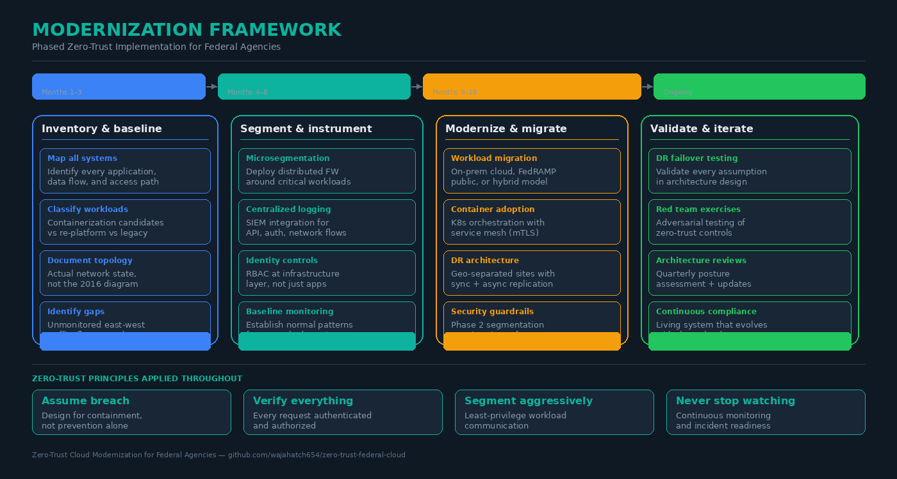

# Zero-Trust Cloud Modernization for Federal Agencies

Lessons from On-Prem Cloud Deployments

This repository contains a technical article and reference architecture diagrams exploring how hands-on experience with on-premise cloud deployments — multi-tenant architecture, network segmentation, DR design, and operational governance — directly maps to the zero-trust modernization challenges facing U.S. federal agencies.

## Architecture diagrams

### Zero-trust reference architecture

### Modernization framework

## Read the article
- [Zero-Trust Cloud Modernization for Federal Agencies](zero-trust-cloud-modernization-federal-agencies.md)

## Topics covered
- East-west and north-south microsegmentation
- Identity-based access at every infrastructure layer
- Centralized monitoring, logging, and incident visibility
- High availability and disaster recovery architecture
- A phased modernization framework for regulated environments

## Author
Cloud Infrastructure Engineer with experience in private cloud deployments, data center operations, and zero-trust architecture design.
